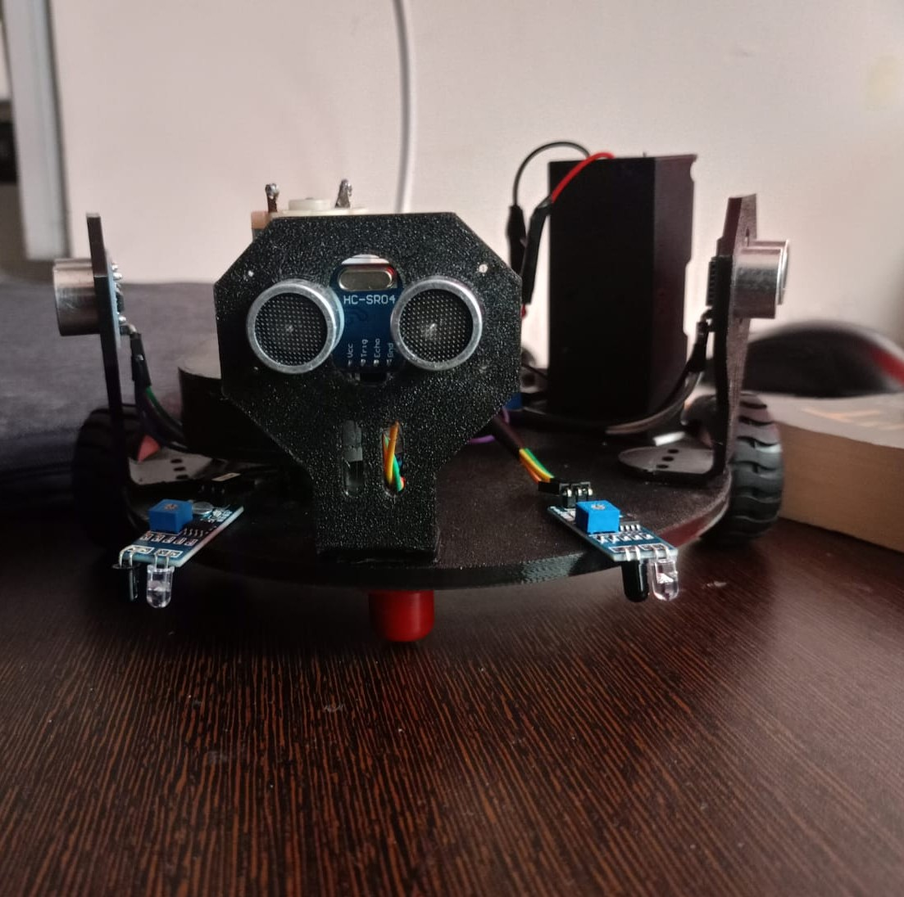

# 🧹 Semi-Autonomous Vacuum Cleaning Robot

## 📌 Overview

A compact semi-autonomous vacuum cleaning robot designed specifically for cleaning **small surfaces like tables and shelves**, where conventional vacuum systems are ineffective.

This project focuses on integrating **mechanical design, electronics, and control systems** into a space-efficient solution.

---

## 🎯 Objective

To design and develop a **compact, lightweight cleaning robot** capable of:

* Navigating small surfaces
* Avoiding obstacles
* Performing basic vacuum-based cleaning

---

## 👥 Team

* 2-member team (including myself)

---

## 🛠️ My Contributions

* Designed and optimized the robot structure using SolidWorks
* Developed compact chassis for constrained spaces
* Assisted in integration of mechanical and electronic systems
* Participated in assembly, testing, and iteration

---

## ⚙️ Components Used

### 🔌 Electronics

* Arduino Nano
* TB6612FNG Motor Driver
* IR Sensor (edge detection / obstacle detection)
* Ultrasonic Sensor (distance measurement)
* Li-ion Battery Pack

### ⚙️ Mechanical

* N20 DC Motors (drive system)
* High RPM DC Motor (vacuum mechanism)
* Custom chassis (3D printed using PLA+)

---

## 🧠 Working Principle

* The robot moves using **differential drive (N20 motors)**
* IR sensor helps prevent falling from edges (table/shelf)
* Ultrasonic sensor detects obstacles ahead
* Microcontroller processes sensor inputs and controls motion
* A high-speed motor generates suction for cleaning

---

## 🧩 Design Highlights

* Compact form factor for confined spaces
* Lightweight structure using PLA+
* Integrated electronics layout to reduce wiring complexity
* Modular design for easy upgrades

---

## 📸 Project Visuals

## 🚧 Current Status

Ongoing – Improving:

* Structural efficiency
* Power optimization
* Cleaning performance

---

## 🚀 Future Improvements

* Autonomous navigation (line/path planning)
* Improved suction mechanism
* Battery management system (BMS integration)
* Smarter obstacle detection (sensor fusion)

---

## 📂 Files Included

* CAD files (SolidWorks + STEP)
* Circuit diagrams
* Component list
* Project documentation

---

## 🎥 Demo

(Add video link here – Google Drive / YouTube)

---
